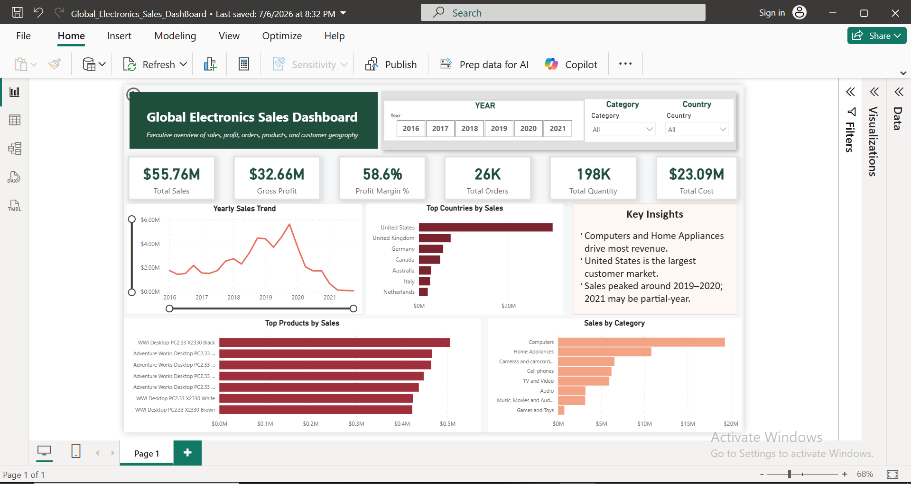

# Global Electronics Sales Dashboard

## Project Overview

This project analyzes sales performance for a global electronics retailer using Power BI. The dashboard provides an executive-level view of sales, profit, orders, product performance, and customer geography.

The objective of this project was to convert raw multi-table business data into a clean, interactive Power BI dashboard that supports management decision-making.

---

## Business Problem

The business needs a single dashboard to answer key questions such as:

- How much revenue and profit has the company generated?
- Which product categories contribute the most sales?
- Which products are the top performers?
- Which customer countries generate the highest revenue?
- How have sales changed over time?
- What business actions should management consider?

---

## Tools Used

- Power BI Desktop
- Power Query
- DAX
- Microsoft Excel
- GitHub

---

## Dataset Source

Dataset: Global Electronics Retailer  
Source: Maven Analytics Data Playground

The dataset was downloaded from Maven Analytics and stored in the `Dataset` folder of this project.

The dataset contains multiple Excel files:
- Sales
- Customers
- Products
- Stores
- Exchange Rates
- Data Dictionary

---

## Data Tables Used

| Table | Description |
|---|---|
| Sales | Transaction-level sales data |
| Customers | Customer demographic and geographic details |
| Products | Product category, brand, cost, and price details |
| Stores | Store location and opening date details |
| Exchange Rates | Currency exchange rate information |

---

## Data Cleaning and Preparation

The dataset required several cleaning steps before analysis:

- Fixed date parsing errors in `Order Date`, `Delivery Date`, and `Open Date`
- Converted incorrect data types such as keys, quantity, and dates
- Changed `Zip Code` from number to text because postal codes are identifiers, not numeric values
- Cleaned currency columns where `$` symbols were stored as text
- Converted `Unit Cost USD` and `Unit Price USD` into numeric values
- Handled blank `Delivery Date` values without removing sales transactions
- Created relationships between fact and dimension tables

---

## Data Model

The model follows a star schema design.

The central fact table is:

- `Sales`

The dimension tables are:

- `Customers`
- `Products`
- `Stores`

Relationships used:

| Fact Table | Dimension Table | Relationship |
|---|---|---|
| Sales[CustomerKey] | Customers[CustomerKey] | Many-to-One |
| Sales[ProductKey] | Products[ProductKey] | Many-to-One |
| Sales[StoreKey] | Stores[StoreKey] | Many-to-One |

---

## DAX Measures

```DAX
Total Quantity = SUM(Sales[Quantity])

Total Orders = DISTINCTCOUNT(Sales[Order Number])

Total Sales =
SUMX(
    Sales,
    Sales[Quantity] * RELATED(Products[Unit Price USD])
)

Total Cost =
SUMX(
    Sales,
    Sales[Quantity] * RELATED(Products[Unit Cost USD])
)

Gross Profit =
[Total Sales] - [Total Cost]

Profit Margin % =
DIVIDE(
    [Gross Profit],
    [Total Sales],
    0
)
```

---

## Dashboard Preview



---

## Key Insights

- Computers and Home Appliances generated the highest sales among all product categories.
- The United States was the largest customer market by sales.
- Sales peaked around 2019–2020, while 2021 may contain partial-year data.
- The business achieved a strong profit margin of approximately 58.6%.
- Revenue is concentrated among a few top-performing products and customer countries.

---

## Business Recommendations

- Prioritize inventory planning and marketing campaigns for high-performing categories such as Computers and Home Appliances.
- Strengthen the United States market while exploring growth opportunities in lower-performing countries.
- Investigate the sales decline after 2020 and confirm whether 2021 contains complete-year data before making final conclusions.
- Monitor top-selling products closely to avoid stockouts and protect revenue.
- Analyze high-margin product categories to support pricing and promotional decisions.

---

## Skills Demonstrated

- Power Query data cleaning
- Data type correction
- Star schema modeling
- Relationship creation
- DAX measure creation
- KPI dashboard design
- Business insight generation
- Executive reporting
- Data storytelling

---

## Project Outcome

This dashboard provides a clear executive summary of business performance and helps stakeholders understand revenue trends, product performance, market concentration, and profitability.

The project demonstrates the ability to clean raw business data, build a reliable data model, create DAX measures, and communicate insights through a professional Power BI dashboard.

